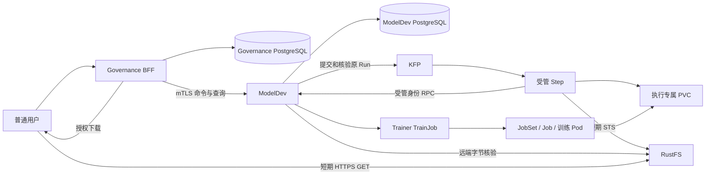

# CPU-P01 功能、实现、扩展、部署与使用指南

更新日期：2026-10-06。面向应用开发、环境交付和运维人员。

2026-10-08 操作补充：旧 CPU-P01 测试 namespace 已按用户要求退役。本文保留历史功能与验收说明；在 `.10～.12` 重新部署到 `ani-system` 并执行命令测试，请使用 [手动复部署与测试手册](cpu-p01-manual-test.md)。新环境测试结果需独立记录。

本文说明已经实现并在 172.16.101.10～12 集群验收的首条 CPU 训练业务链：
**普通用户登录 → Governance BFF 授权和持久受理 → ModelDev 执行 → KFP/Trainer 训练 → 四文件发布 → 用户下载并在脱离原训练卷的环境中加载模型**。

本文的验收源码基线为 ModelDev 运行代码 `37d6a3548ed06e82942a68faf238940853c5be79`、当时的交付 HEAD `85619dd5b3fd9213122ddde50a157a85a594ee38`，以及 Governance `43701f5f3aea6fd81984eb19c98775185ad204b4`。该交付 HEAD 的最后一次变化是 BOM 更新，未生成另一个运行镜像。后续文档提交与 main 合入不改变这里记录的运行验收来源。

本次编写读取代码和既有验收记录，没有重新部署或重新训练。当前环境身份、镜像 digest、证据和恢复记录只维护在本机 `.scratch/cpu-p01/handoff.md` 与 `.scratch/cpu-p01/cpu12-delivery-20261005/final-delivery-index.json` 中；这些现场资料不随源码提交，远端仓库读者需向环境交付者取得对应记录。本文不复制不断变化的 Pod UID、登录凭据和完整验收账本。

## 1. 已实现的功能

### 1.1 功能范围

| 功能 | 已实现的行为 |
| --- | --- |
| 租户身份和授权 | 普通登录后经 Governance BFF 调用；每次创建、重放、查询、下载和 Stop 都核对本次权限与租户范围 |
| 训练预设和 Release | Preset 表示受支持方案；Release 固定流程版本、镜像、Runtime、参数、资源和输出合同；当前启用绑定由 Governance 管理 |
| 输入版本导入 | 登记批准存储范围内的固定 S3 VersionID；实际核对字节数、SHA256、CSV 内容后，持久化为 READY InputVersion |
| 可靠受理和幂等 | 同键、同意图返回原 Execution；同键不同意图拒绝；Governance 可靠投递，ModelDev 事务持久化后 ACK |
| 执行快照冻结 | 固定输入、Release、镜像 digest、Runtime、参数、资源和原截止时间；后续默认版本切换不改变在途执行 |
| 真实 CPU 训练 | KFP 驱动工作流；ModelDev 创建并观察 Trainer TrainJob，实际计算在关联训练 Pod 内进行 |
| 执行查询 | 列表、详情、阶段和有界训练日志；查询按租户过滤，日志读取核对实际训练 Pod UID |
| 结果发布与下载 | 发布 `model.pt`、`model_config.json`、`metrics.jsonl`、`summary.json`；远端固定版本字节核验后才记为 PUBLISHED；BFF 授权短期下载 |
| Stop、失败、deadline 和恢复 | 持久化创建围栏，停止原运行，核实真实写者终态；服务重启后恢复原执行，不重新训练替代原执行 |
| 运行检查和清理 | 管理员可 Inspect、Reconcile、生成清理计划并 Apply；正常清理保留工作区、发布产物和审计 |

两次独立真实复演均完成训练、发布、普通 BFF 下载、SHA 校验和安全 CPU 重载；还验收了版本冻结、在途服务重启和跨执行隔离。另一个已有成功执行完成正式清理并在清理后再次下载、加载。具体用例和历史失败保留在交付索引中。

### 1.2 当前训练方案

这是一条固定训练方案，不是任意脚本训练平台。

| 项目 | 当前合同 |
| --- | --- |
| 类型 | `GENERAL_TRAINING`，CPU 单节点、单进程 |
| 输入 | CSV，表头 `x0`～`x15,label`，恰好 1024 条样本，16 个有限 float32 特征，标签 0 或 1，最多 32 MiB |
| 网络 | MLP，`16 → 32 → 2` |
| 训练 | Adam，3 个 epoch，batch size 64，共 48 次 optimizer update |
| 可调整参数 | `learning_rate`，十进制字符串，范围 `(0, 0.1]`，默认 `0.01` |
| 文件交接 | 每执行独立 PVC 工作区，固定输入和输出路径 |
| 输出 | 四个已发布文件；训练侧的候选清单不等于发布证明 |
| 容器身份 | Step 和训练使用 UID/GID `10001:10001`，环境提供相应卷写权限 |

当前未提供浏览器上传、multipart、任意程序、微调、Model 服务登记、GPU、分布式训练、推理服务和前端界面。验收用的 `fail`、`slow-stop` 是内部训练配方，普通用户不能把故障注入参数当作训练参数提交。

## 2. 用什么方式实现

### 2.1 系统分工



| 组件 | 责任 |
| --- | --- |
| Governance / BFF | 用户登录与当前授权、资源租户映射、幂等受理、当前 Release 绑定、可靠投递、用户查询入口 |
| ModelDev | 执行事实、不可变快照、唯一权威 Run、创建许可、TrainJob、结果验证、创建围栏、关闭和恢复 |
| KFP | 正常流程的阶段推进；执行 `prepare → train-wait → collect → publish → close`，并保留退出收尾路径 |
| Trainer / JobSet | 根据 TrainJob 创建实际计算工作负载 |
| RustFS | 版本化输入和发布对象、短期 STS 和 HTTPS 下载 |
| installer / 环境交付 | Kubeflow、Runtime、存储和卷权限、身份基础、RBAC、网络、CA/入口及每套环境的实际 profile |

ModelDev 后台 worker 负责持久投递、观察和关闭恢复；它不会再按数据库阶段自行重演一套训练流程。正常阶段推进由 KFP 负责。Step 不能自行创建 TrainJob。

### 2.2 代码结构与核心机制

| 入口或目录 | 作用 |
| --- | --- |
| `cmd/ani-modeldev-service/` | 显式组装数据库、命令入口、受管 Step、KFP/Trainer/S3 适配器和后台 worker |
| `internal/service/` | 将内部 RPC 转为业务用例；包含命令、材料、查询、受管步骤和运维操作 |
| `internal/biz/` | 执行、受理、创建、发布、关闭和清理规则；不依赖 transport 或数据库驱动 |
| `internal/data/{execution,submission,lifecycle,input}/` | PostgreSQL 持久化、唯一约束、事务、inbox、Run 绑定和关闭事实 |
| `internal/data/{trainer,runtimeproof,workspace,objectstore}/` | 实际资源关联、工作区、训练观察和远端版本字节证明 |
| `internal/data/{catalogue,admissionfacts}/` | 不可变 Release 目录、按 tenant/Release 固定的环境和受理材料 |
| `internal/data/storagecredentials/` | 受限 RustFS 控制身份与按执行、用途收窄的 STS 签发 |
| `contract/cpup01/` | Intent、Snapshot、Release、输出清单的规范格式和摘要合同 |
| `pipelines/cpu_p01.py`、`internal/component/` | KFP 编排与真实单步组件；Step 镜像独立于服务镜像 |
| `training/` | CPU PyTorch 训练程序、锁定依赖和独立 checkpoint 消费验证 |
| `migrations/` | ModelDev 数据库版本迁移，目前到 `0017` |

关键行为如下：

1. **先授权，再检查原幂等键。** 原键重放必须通过本次授权；旧 Actor 只用于审计。只有原键未命中才读取当前 Release 绑定，随后事务复核 generation 并冻结完整快照。
2. **区分意图和执行规格。** `intent_hash` 保留用户原始选择的存在性；`execution_spec_hash` 固定解析后的完整训练规格。省略参数和显式空数组可能是不同意图，不能替用户改写原键请求。
3. **事务和唯一约束控制重复。** Execution、Operation、权威 Run、训练创建意图和主发布都有持久约束。响应丢失后查找、关联原对象；结果不明时保留 uncertain 和创建围栏，不盲重发创建。
4. **双向核实受管工作负载。** Step 请求经过 TokenReview，并核对当前 ServiceAccount、Pod、Workflow、原 KFP Run 和任务关联；用户不能把这些身份放入 body 来取得权限。
5. **发布依赖实际字节。** 采集和上传只产生候选；ModelDev 核实 S3 VersionID、大小、SHA256及上传写者结束后才形成 Publication。
6. **关闭和删除分开。** Stop 返回、Pod 删除标记或一次 NotFound 都不足以证明 CLOSED。必须封闭创建并证明全部实际写者停止；清理是之后的独立管理动作。

### 2.3 状态应如何理解

| 状态或回执 | 含义 |
| --- | --- |
| HTTP `202` / 已受理 | 请求已持久接受或停止意图已记录，不代表训练已完成 |
| `compute_state` | 计算进展与结果，如 TRAINING、SUCCEEDED；不能单独判断文件交付 |
| `delivery_state=PENDING` | 尚未完成核验发布；发布失败也可能保留在此状态，另查错误和关闭事实 |
| `delivery_state=PUBLISHED` | 有已核验发布和固定版本产物 |
| `close_state=CLOSED` | 创建围栏和实际写者终态已经成立；不代表 PVC 或发布对象已删除 |
| 清理 `APPLIED` | 本次正式 Apply 已按计划确认资源不存在 |
| 清理 `RECONCILED` | 保留原失败/未知历史后，通过正式核对恢复审计；不能改称原 Apply 成功 |

当前 delivery 枚举只有 `PENDING/PUBLISHED`。部分早期设计文档记录了实现切片当时的状态和未接项，阅读时应以当前代码及交付索引为准。

### 2.4 RustFS 身份如何使用

installer 为每个调用服务配置独立的受限控制身份。ModelDev 服务实例可以使用同一服务的控制身份；多个独立业务服务分别使用各自身份，便于收窄权限、轮换和审计。无需每新增一个业务租户，就人工创建一个 RustFS 用户。

ModelDev 控制进程挂载长期身份材料，受管 Step 通过已核验的工作负载 RPC 获取短期 STS，按 tenant、Execution 和 prepare/publish 用途限制 bucket/prefix。当前 STS 有效期为 900 秒，关闭中的执行不能新签发或续签。Step 和训练不挂载长期存储 Secret。

CSV 导入当前使用专用父身份进行版本化对象全字节核验，与执行阶段的 native STS 路径不同。这项核验不会向普通用户发放该身份。用户下载通过 BFF 获得固定 VersionID 的 60 秒 HTTPS GET 地址。

## 3. 后续如何扩展

### 3.1 按变化类型扩展

| 扩展目标 | 应修改或增加的部分 | 保留的约束 |
| --- | --- | --- |
| 同合同的新程序版本或默认版本 | 新训练镜像或 PipelineVersion、新不可变 Release、对应 facts；Governance CAS 切换绑定 | 保留旧 Release，已受理快照不变 |
| 新租户 | 业务租户映射与授权、独立 namespace/SA/存储范围、KFP experiment、facts 和绑定 | 不共享工作区；每次查询按租户过滤；不要求新建人工 RustFS 用户 |
| 新环境 | installer 输出新环境 profile；重新绑定 CA、入口、namespace/SA UID、Runtime、存储、PipelineVersion 和真实证据 | 不能复制旧集群 UID/digest 冒充新环境事实 |
| 新算法、输入维度或参数 | 共享合同、输入 verifier、参数解析、训练程序、Release、消费者和行为测试 | 不能只换镜像绕过原输入/输出合同 |
| 新输出文件或格式 | output contract、collector、publication verifier、下载元数据和消费方 | 仍以固定远端版本的实际字节证明发布 |
| 新流程阶段 | KFP assembly、Step 实现、任务身份校验、关闭和恢复规则 | 继续由 KFP 推进正常流程；保留唯一 Run 和创建围栏 |
| GPU / 多节点 | 资源快照、配额和设备分配合同、Trainer Runtime 与观测、环境验收 | 属于新增能力，不由当前 CPU 验收覆盖 |
| 上传、微调、Model 登记或推理 | 分别增加明确业务用例及相应服务集成 | 不将四文件发布直接等同于 Model 已登记或推理已上线 |

兼容更新优先通过不可变 Release 与环境绑定完成。超出合同的能力则增加真实纵向用例，并同步权限、持久化、幂等和副作用约束。

当前静态受理 facts 配置限定每进程 1～64 个显式文件；运行时 dispatch binding 绑定一个 tenant/environment。A/B 已验证输入归属和查询隔离，不能据此声称一台当前实例已具备任意多租户执行调度。扩大规模时，需要明确实例分片或受管多租户 binding 解析，并新增多租户实际执行验收。

### 3.2 环境和应用的责任边界

**installer** 负责环境可用性和安装输出：KFP、Trainer、JobSet、Runtime、UID/GID/卷权限、StorageClass、服务身份基础、RustFS 策略、RBAC、网络和 profile。身份签发机制及其环境配置由 installer 交付；ModelDev 使用相应受限身份签发执行范围内的临时会话。

**ModelDev / Governance** 负责业务代码、应用配置和部署材料、数据库迁移、Release 导入/启用、租户授权、业务受理和结果消费。新租户的业务接入应由业务 provisioning 流程触发环境资源和存储范围配置；不应要求人工每次重新安装环境。

需求合同只保留一份；每套安装环境分别保存实际 profile 和验收记录。当前 10～12 环境的手工 Runtime/卷权限兼容改动已经验收，但尚未写回 installer 产品路径。这是后续环境产品化工作。

## 4. 如何部署

### 4.1 当前交付形式

仓库提供服务、Step、训练的源码与镜像构建材料、KFP 编译器和 typed runtime 配置。当前业务部署在任务环境内完成；**尚未提供能够替所有新环境完成配置、授权和业务部署的一条 installer 命令或通用 Helm 包**。

部署可分两种情况：已有 10～12 环境复用已验收镜像和 profile；新环境先完成下面的基础设施与材料准备，再部署应用和导入业务 Release。任务里的 `*-once.py`、旧 ledger 和硬编码恢复脚本记录的是特定对象的一次操作，不是可反复执行的通用安装器。

本文命令中的 `$TASK_*`、`<...>`、`service=modeldev_owner` 都需要换成该环境批准的值；不包含任何实际密码、JWT 或私钥。本任务的构建、SQL、Pipeline 编译和集群操作仍在 `ssh fedora` 环境执行。

### 4.2 新环境的前置条件

| 类别 | 必须准备并实际核实的内容 |
| --- | --- |
| Kubernetes / Kubeflow | 已安装并可用的 KFP、Trainer、JobSet 与 CRD；本套基线为 KFP 2.16.0、Trainer 2.1.0、JobSet 0.10.1，其他版本需重新验证 |
| Runtime | 匹配 Release 的 Runtime API/kind/name、内容摘要和 target jobs；本套 replicated job 名为 `node`，应用按真实 Runtime 名称映射，不硬编码另一名称 |
| 工作区 | 受支持 StorageClass、容量和 access mode；真实节点能挂载；Step/训练以 10001 身份实际能写 |
| 身份 | 控制、Step、训练、verifier 分离的 ServiceAccount；KFP 控制 token 的 audience；TokenReview、当前 Pod 读取和最小资源权限 |
| 网络 / TLS | Governance→命令口、Step→受管口、控制面→KFP/Kubernetes/S3/PostgreSQL 的必要连通；其余入口通过 NetworkPolicy/TLS 限制 |
| 数据库 / 会话 | Governance 与 ModelDev 各自受限运行角色和数据库；迁移角色独立；Governance 的 Redis/Valkey 会话及 JWT 密钥材料 |
| RustFS | HTTPS/CA、版本化输入和发布 bucket、批准的连接与前缀、ModelDev 独立受限控制身份及 STS 策略 |
| 业务授权 | Governance 初始化、资源租户映射、用户/角色/套餐、接口登记与当前权限；管理操作需要材料管理权限 |

UID/GID 10001 是本方案的容器身份合同，不是所有 Kubeflow 集群的普遍要求。installer 可以用匹配的 Runtime 安全上下文和卷组权限交付兼容环境；最终必须用真实写入证明权限成立。

### 4.3 数据库准备

ModelDev 服务启动只打开受限连接池，不自动迁移、不创建角色。先由 owner/migration 身份为新数据库应用 `migrations/0001`～`0017`，随后配置 runtime 角色的最小表/列权限；runtime 不能是 superuser 或 BYPASSRLS，也不能获得迁移角色权限。

以下只适用于**全新、空的 ModelDev 数据库**。通过受保护的 libpq service/password 文件准备 `modeldev_owner` 连接，避免把 DSN 明文写入命令：

```sh
for task_migration in migrations/*.up.sql; do
  psql 'service=modeldev_owner' --set=ON_ERROR_STOP=1 \
    --single-transaction --file "$task_migration"
done
```

已有数据库必须依据原迁移记录只执行未应用版本，并保留迁移账本；不能对已有库从 0001 重跑。Governance 使用其仓库内的版本迁移体系，包含 CPU 受理、绑定、投递和 Stop 迁移。运行角色授权和业务初始化是独立步骤，上面的 SQL 循环不完成这些准备。

升级到当前版本必须包括 `0017_cleanup_reconciliation`。回滚需同时检查 schema、二进制、冻结 Release 和环境 profile；不能只把镜像换成旧版本并认定恢复完成。

### 4.4 构建与交付镜像

需要三类 ModelDev 镜像：服务、Step、训练；Governance 有自己的应用镜像。它们可以来自不同固定源码提交，只要 Release 与实际环境映射完整一致。

在干净的固定 Fedora checkout，服务镜像可按以下方式构建；输出目录应是本次新目录，基础镜像和依赖已预备：

```sh
task_source_sha=$(git rev-parse HEAD)
task_image_tag="localhost/ani-modeldev-service:$task_source_sha"
mkdir -p "$TASK_SERVICE_BUILD_DIR"
CGO_ENABLED=0 GOOS=linux GOARCH=amd64 go build \
  -trimpath -buildvcs=false \
  -ldflags "-X main.Name=ani-modeldev-service -X main.Version=$task_source_sha" \
  -o "$TASK_SERVICE_BUILD_DIR/ani-modeldev-service" ./cmd/ani-modeldev-service
cp deploy/service.Dockerfile "$TASK_SERVICE_BUILD_DIR/Dockerfile"
podman build --network=none --pull=never --format=oci \
  --label "org.opencontainers.image.revision=$task_source_sha" \
  --tag "$task_image_tag" "$TASK_SERVICE_BUILD_DIR"
podman image inspect --format '{{.Digest}}' "$task_image_tag"
```

Step 按相同方法独立编译 `./cmd/ani-modeldev-step` 并使用 `pipelines/step.Dockerfile` 打包。训练使用 `training/build-image.sh FULL_SOURCE_SHA WHEELHOUSE NEW_RUN_DIRECTORY`，依赖固定的离线 wheelhouse 和基础镜像，详见[训练构建说明](../training/README.md)。Pipeline 编译另见[Pipeline 说明](../pipelines/README.md)。

镜像交付选择环境内受管 registry，或离线导入各个可调度节点；保留源提交、manifest digest、归档 SHA 与实际 CRI image identity 映射。registry 地址改变后也应核验 digest。归档文件 SHA、镜像 manifest digest 和 CRI config ID 不是同一种身份。

**按变化构建，避免重建无关镜像：**

| 变化 | 需要的动作 |
| --- | --- |
| 仅 ModelDev 服务代码 | 重建服务镜像；复用兼容的 Step/训练/Governance 镜像 |
| Step 代码 | 重建 Step；重新编译引用它的 Pipeline，生成新 PipelineVersion/Release |
| 训练程序或依赖 | 重建训练镜像，生成新 Release 和环境材料 |
| Governance 代码 | 重建 Governance；其他镜像按实际合同影响判断 |
| runtime 配置或超时 | 更新配置并重启相应应用，不为配置改动重建镜像 |
| 仅文档 / BOM | 不重建运行镜像；BOM 按供给链门禁处理 |

`make verify` 包含 Go 测试、vet 和编译；GitHub CI 也执行验证。这些不是镜像构建。`make build` 会产出服务和 Step 两个二进制；服务单独打包可使用上面的单目标命令。最近的服务修复实际只构建一个服务镜像，再将同一归档导入三个节点。

### 4.5 准备应用材料

以[受管 runtime 模板](../configs/examples/managed-runtime.yaml)为起点，用新环境实际值生成 `config.yaml`，不能直接启动带占位符的模板或只用默认 `configs/config.yaml`。完整业务装配需要 `command`、`command.admission_resolution` 和 `runtime`。

| 材料 | 交付方式与用途 |
| --- | --- |
| ModelDev runtime DSN | Secret 文件；`command.database_url_file` 引用 |
| 命令 TLS 证书/私钥及客户端 CA | 私钥为 Secret，CA 可为受信 ConfigMap；验证 Governance mTLS 身份 |
| 受管 Step TLS 证书/私钥 | 供 Step 的 TLS listener 使用，另核实 Step workload token |
| Kubernetes token/CA | 当前控制 ServiceAccount 的 workload token；不能用转发的用户 JWT |
| KFP token/CA | audience 匹配 KFP 的 projected token，使用原控制身份 |
| RustFS `control.json` | Secret，只挂载控制服务；保存受限 IAM 身份及 `sts_bindings`，字段见 runtime 模板 |
| Release 目录 | 保留的受管卷，按 Release ID 存不可变 canonical JSON |
| admission facts | 每 tenant/Release 的完整环境事实文件及各自字节 SHA，显式列在 `facts_files` |
| dispatch binding | tenant/environment 和 owner 配置的 JSON 及实际 SHA，由 `binding_file/binding_sha256` 引用 |
| Step owner ConfigMap | `config.json`、ModelDev/S3 CA；租户、namespace UID、Step 目标、工作区路径等见 Pipeline 说明 |

facts reader 不支持末级符号链接文件。ConfigMap 投影需以实际 regular readonly/subPath 文件挂载 facts；当前部署也对相应配置、CA 和 binding 使用 subPath。配置按启动时加载，使用新 immutable ConfigMap 和重新启动交付，不能假定热更新。

本套已验收监听和预算如下；新环境可以另选端口，但必须同步 Service、TLS 名称和 NetworkPolicy：

| 配置 | 当前环境值 |
| --- | --- |
| `server.grpc.addr` / timeout | `0.0.0.0:9000` / `30s`，Governance 命令和查询 mTLS 口 |
| `runtime.step.addr` / timeout | `0.0.0.0:9001` / `30s`，受管 Step 口 |
| `server.admin.addr` | `0.0.0.0:9002`，健康、就绪、指标 |
| Governance 下游 timeout | `ANI_MODELDEV_TIMEOUT=60s` |
| 管理 CLI 下游 timeout | `ANI_MODELDEV_TIMEOUT=60s` |

runtime 模板历史 `10s` 和默认配置 `1s` 不等于本套可复演预算。Governance 的环境字段是 `ANI_MODELDEV_ADDR`、`ANI_MODELDEV_CA`、`ANI_MODELDEV_CERT`、`ANI_MODELDEV_KEY`、`ANI_MODELDEV_TIMEOUT`；CA/证书/私钥项保存挂载路径，不能填 PEM 内容。服务端证书需满足 Governance 固定校验的 `ani-modeldev-service` 身份；ModelDev 则校验配置指定的 Governance 客户端 DNS 身份。

### 4.6 部署顺序

1. **准备环境和数据库。** 完成 4.2～4.3，核实真实 namespace/SA UID、Runtime、存储写权限及业务授权。
2. **交付镜像、证书和 Secrets。** 每个可调度节点可用；为当前 workload 配置正确 audience 的 token；不把凭据放进普通 ConfigMap、IR 或 Git。
3. **生成 Step owner 配置和 Pipeline IR。** 在固定 KFP 虚拟环境执行 `"$TASK_KFP_VENV/bin/python" pipelines/cpu_p01.py --config "$TASK_COMPILE_CONFIG" --output "$TASK_PIPELINE_IR"`。编译配置显式包含 Step digest、owner ConfigMap、StorageClass、workspace size/access mode。
4. **上传真实业务 PipelineVersion。** 通过环境的 KFP 导入入口上传 IR，获取实际 Pipeline/Version/Experiment 身份和 IR SHA；不能用测试 fixture 或环境探针 ID 替代业务绑定。
5. **生成 Release、facts、dispatch binding 和应用配置。** 将真实 PipelineVersion、Runtime target jobs（本套为 `node`）、镜像、存储和工作区合同关联；写入目录和受管挂载。导入之前可准备 Release 文档，正式导入见 5.1。
6. **部署 ModelDev 和 Governance。** 使用受管 Deployment/Service，命令口只对 Governance、Step 口只对受管工作负载开放。ModelDev 进程入口为 `/ani-modeldev-service -conf /etc/modeldev/config.yaml`，挂载上述材料和保留的目录卷；配置非 root、安全上下文、资源预算和健康探针。当前 profile 验收的是单副本，扩大副本需另做一致性与可用性验收。
7. **导入材料并启用绑定。** 通过管理员 CLI 导入 Release、核验 CSV，最后 CAS 启用租户 Preset→Release。
8. **检查部署和业务。** 先核实镜像/配置 identity、Ready、探针、事件、RBAC 和挂载，再执行 5.2～5.4 的真实创建、发布、下载与重载；Pod Ready 本身不完成业务验收。

KFP IR 不包含长期 S3 凭据；只暴露 `execution_id/spec_hash` 两个 Run 参数，其余绑定来自受管 owner 配置。Prepare/collect/publish 挂载工作区；Pipeline 不执行 DeletePVC，训练以 Release 中的固定程序和 argv 启动。

对新环境，应将生成的 Deployments、Services、RBAC、NetworkPolicy、证书引用、材料和验收保存为该环境的版本化交付包。本文给出配置合同与顺序；目前这些环境材料仍需交付者生成，不能把历史任务脚本当作完整通用部署包。

下面是**单租户正常 Release 的 ModelDev Deployment/Service 骨架**，不是当前集群对象的直接导出。先替换 namespace、镜像 digest、对象名称，按 4.5 准备配置和 Secrets，并使 `facts_files` 指向这里挂载的 `success.facts.json`。新增 Release/facts 时同步增加挂载。ServiceAccount、PVC、ConfigMap、Secret、RBAC 和网络策略均须先存在；Governance 部署还需要它自己的数据库、会话、JWT 与 mTLS 材料。

```yaml
apiVersion: apps/v1
kind: Deployment
metadata:
  name: ani-modeldev
  namespace: ani-modeldev-example
spec:
  replicas: 1
  strategy:
    type: Recreate
  selector:
    matchLabels:
      app: ani-modeldev
  template:
    metadata:
      labels:
        app: ani-modeldev
    spec:
      serviceAccountName: modeldev-control
      securityContext:
        runAsNonRoot: true
        runAsUser: 10001
        runAsGroup: 10001
        fsGroup: 10001
      containers:
        - name: modeldev
          image: <registry>/ani-modeldev-service@sha256:<manifest-digest>
          imagePullPolicy: IfNotPresent
          args: ["-conf", "/etc/modeldev/config.yaml"]
          ports:
            - {name: command, containerPort: 9000}
            - {name: step, containerPort: 9001}
            - {name: admin, containerPort: 9002}
          resources:
            requests: {cpu: 100m, memory: 256Mi}
            limits: {cpu: "2", memory: 1Gi}
          securityContext:
            allowPrivilegeEscalation: false
            readOnlyRootFilesystem: true
            capabilities:
              drop: [ALL]
          readinessProbe:
            httpGet: {path: /readyz, port: admin}
          livenessProbe:
            httpGet: {path: /healthz, port: admin}
          volumeMounts:
            - {name: config, mountPath: /etc/modeldev/config.yaml, subPath: config.yaml, readOnly: true}
            - {name: config, mountPath: /etc/modeldev/dispatch-binding.json, subPath: dispatch-binding.json, readOnly: true}
            - {name: config, mountPath: /etc/modeldev/facts/success.facts.json, subPath: success.facts.json, readOnly: true}
            - {name: config, mountPath: /etc/modeldev/ca/grpc-ca.crt, subPath: grpc-ca.crt, readOnly: true}
            - {name: config, mountPath: /etc/modeldev/ca/kfp-ca.crt, subPath: kfp-ca.crt, readOnly: true}
            - {name: config, mountPath: /etc/modeldev/ca/s3-ca.crt, subPath: s3-ca.crt, readOnly: true}
            - {name: private, mountPath: /var/run/modeldev-private, readOnly: true}
            - {name: kfp-token, mountPath: /var/run/modeldev-kfp, readOnly: true}
            - {name: catalogue, mountPath: /var/lib/modeldev/catalogue}
      volumes:
        - name: config
          configMap:
            name: modeldev-runtime-config
        - name: private
          secret:
            secretName: modeldev-runtime-private
            defaultMode: 0440
        - name: kfp-token
          projected:
            defaultMode: 0440
            sources:
              - serviceAccountToken:
                  audience: pipelines.kubeflow.org
                  expirationSeconds: 3600
                  path: token
        - name: catalogue
          persistentVolumeClaim:
            claimName: modeldev-catalogue
---
apiVersion: v1
kind: Service
metadata:
  name: ani-modeldev
  namespace: ani-modeldev-example
spec:
  selector:
    app: ani-modeldev
  ports:
    - {name: command, port: 9000, targetPort: command}
    - {name: step, port: 9001, targetPort: step}
    - {name: admin, port: 9002, targetPort: admin}
```

Secret 对应 `database.dsn`、`tls.crt`、`tls.key`、`control.json` 等配置引用。采用 registry 拉取或离线本地镜像时分别设置正确 pull policy 和镜像地址。这个骨架采用单副本 Recreate，会有更新停机；若调整滚动策略，需要同时核实目录卷 access mode 和资源配额，不能默认双实例可挂载。

准备好环境包后，执行：

```sh
kubectl --context "$TASK_KUBE_CONTEXT" apply --dry-run=server \
  -f "$TASK_APPLICATION_MANIFEST"
kubectl --context "$TASK_KUBE_CONTEXT" apply -f "$TASK_APPLICATION_MANIFEST"
kubectl --context "$TASK_KUBE_CONTEXT" -n "$TASK_NAMESPACE" \
  rollout status deployment/ani-modeldev --timeout=180s
```

dry-run 与 rollout 只检查部署过程；随后仍需实际业务创建、四文件下载和重载。这里的骨架未作为新环境部署重新执行，已经运行的任务环境使用其独立受验收 profile。

### 4.7 复用当前 10～12 环境

当前 context 为 `kubernetes-admin@ani-lab`；系统 namespace 为 `ani-cpu-p01-system`，租户测试 namespace 为 `ani-cpu-p01-tenant-a/b`。实际 Deployment、镜像、配置及 namespace UID 以当前交接为准。

Fedora 证据根：`/home/chabking/workspace/cpu-p01-20260930-01`。基础设施引用在 `live-foundation-20261005-01/references.json`；当前配置/部署回执在 `stages/runtime-timeout-budget-37d-20261006-01/`。完整独立使用设施见本机 `.scratch/cpu-p01/runs/20260930-01/cpu12-independent-replay/README.md`；该操作说明和私有复演材料由环境交付者提供。

使用前重新普通登录，核实当前 preset generation、实际 Ready 镜像和配置；旧 access token 不能长期复用。新请求使用新的幂等键；恢复原请求则保留原键和原意图。已有保留卷、Publication、失败审计和一次性账本不能被部署脚本覆盖。

## 5. 如何使用

### 5.1 管理员准备训练材料

管理员通过 Governance 的 `admin` 可执行文件完成材料管理。它读取现有 Governance 配置，验证普通用户 JWT/会话与管理权限，再经 mTLS 调用 ModelDev；没有绕过业务授权的本地直连写库步骤。

顺序为：把合规 CSV 写入批准的 S3 输入范围，保留固定 VersionID/大小/SHA → 导入 Release → 导入并验证 CSV → CAS 启用绑定。当前没有面向普通用户的文件上传或 Release 管理 HTTP 接口。

```sh
admin modeldev-import-release --conf "$TASK_GOVERNANCE_CONFIG_DIR" \
  --token-file "$TASK_ADMIN_TOKEN_FILE" --request-file "$TASK_RELEASE_REQUEST_FILE"
admin modeldev-import-csv --conf "$TASK_GOVERNANCE_CONFIG_DIR" \
  --token-file "$TASK_ADMIN_TOKEN_FILE" --request-file "$TASK_INPUT_REQUEST_FILE"
admin modeldev-enable --conf "$TASK_GOVERNANCE_CONFIG_DIR" \
  --token-file "$TASK_ADMIN_TOKEN_FILE" --request-file "$TASK_ENABLE_REQUEST_FILE"
```

token/request 文件应使用绝对路径、regular file、权限 0600，并满足 CLI 的文件校验。令牌不写入命令参数值、普通配置或日志。所用身份需要 `modeldev:manage_release_binding` 等当前操作权限。

| 操作 | 请求文件主要字段 |
| --- | --- |
| import-release | `preset_id`、`release_id`、`release_digest`、`canonical_release`；后者为 canonical Release bytes 的 Base64 |
| import-csv | `input_version_id`、`release_id`、`release_digest`、`object`、`requested_at` |
| CSV object | `storage_connection_id`、`bucket`、`key`、`version_id`、`size_bytes`、`sha256` |
| enable / pause | `preset_id`、`release_id`、`release_digest`、`expected_generation`、`reason`、`evidence_reference` |

首次启用请求使用 `expected_generation=0`，成功后的实际绑定 `generation=1`；之后先读当前 generation，再用 CAS 更新。输入导入重试保留原请求和 `requested_at`；成功导入后检查 InputVersion 已 READY。更多字段以 `api/ani/modeldev/v1/management.proto` 与 Governance CLI 的请求类型为准。

### 5.2 普通用户创建和查询

先通过部署环境的普通 IAM/BFF 登录获得 access token。调用入口是 **Governance BFF** 的 `/admin/v1/modeldev/*`，不是 ModelDev 的内部命令口或受管 Step 口。

要求 JWT、Redis 会话、租户、用户、角色、套餐/模块与当前 API 授权均有效；当前 ModelDev 查询要求租户 `ALL` 数据范围，较窄数据范围未实现时会拒绝。tenant/actor 由可信登录上下文确定，用户不能在 body 中选择 namespace、Pod 或对象存储 key。

| 方法 | HTTP 路径 |
| --- | --- |
| GET | `/admin/v1/modeldev/presets` |
| GET | `/admin/v1/modeldev/input-versions?state=READY` |
| GET | `/admin/v1/modeldev/input-versions/{id}` |
| POST | `/admin/v1/modeldev/executions` |
| GET | `/admin/v1/modeldev/executions` |
| GET | `/admin/v1/modeldev/executions/{id}` |
| GET | `/admin/v1/modeldev/executions/{id}/logs?tail_lines=100&max_bytes=8192` |
| POST | `/admin/v1/modeldev/executions/{id}:stop` |
| GET | `/admin/v1/modeldev/executions/{id}/artifacts` |
| GET | `/admin/v1/modeldev/artifacts/{artifact_id}/content` |

请求携带 `Authorization: Bearer <access-token>`。列表支持 `page_size`（最多 100）与 `page_token`；日志最多 1000 行、65536 字节，限时读取实际关联训练 Pod。

从 preset 和 READY 输入列表取得 ID 后，创建示例：

```http
POST /admin/v1/modeldev/executions
Authorization: Bearer <access-token>
Content-Type: application/json

{
  "name": "cpu-mlp-demo",
  "kind": "GENERAL_TRAINING",
  "preset_id": "<preset-uuid>",
  "dataset_version_id": "<ready-input-version-uuid>",
  "idempotency_key": "cpu-demo-001",
  "general_parameters": [
    {"name": "learning_rate", "type": "DECIMAL", "value": "0.01"}
  ]
}
```

参数值是字符串；可以省略参数使用 Release 默认值，不能把省略、空数组和显式默认值视为完全相同的重试意图。epochs/batch_size 只能是当前合同中的 3/64；`image_version_id` 只允许选定 Release 兼容的登记版本；`source_execution_id` 当前不可用，普通请求应省略。

返回 `202` 和 `execution_id/operation_id/resolved_release_id/replayed` 表示持久受理。随后轮询 execution 详情，并结合计算、交付和关闭三类状态判断结果。

请求超时或响应丢失时，保留**同一幂等键、同一完整意图**重试，读取原执行；同键改参数会返回 `409`。有意再次训练时才使用新键。当前授权已撤销时，原键也不能绕过授权重放。

### 5.3 下载和使用模型

1. 等待 `delivery_state=PUBLISHED`，读取执行的 artifacts 列表，保存每个文件的大小和 SHA256。
2. 对每个 artifact ID 调用 `.../artifacts/{artifact_id}/content`，获得 `download_url/expires_at`。这是短期授权地址，不是文件响应。
3. 在有效期内通过 HTTPS 下载；地址失效则重新经 BFF 授权。URL 属于凭据，不放入日志或长期记录；响应使用 `Cache-Control: no-store`。
4. 核对四个文件的长度和 SHA256，再在具有兼容 CPU PyTorch 的独立环境加载。

独立消费方式如下，`weights_only=True`、`strict=True` 和配置检查都应保留：

```python
import json
from pathlib import Path
import torch
from torch import nn

root = Path("/absolute/downloaded-artifacts")
expected = {
    "architecture": "mlp-16-32-2", "input_dim": 16,
    "hidden_dim": 32, "output_dim": 2, "dtype": "float32"
}
if json.loads((root / "model_config.json").read_text()) != expected:
    raise ValueError("model configuration does not match this consumer")
weights = torch.load(root / "model.pt", map_location="cpu", weights_only=True)
model = nn.Sequential(nn.Linear(16, 32), nn.ReLU(), nn.Linear(32, 2))
model.load_state_dict(weights, strict=True)
model.eval()
with torch.inference_mode():
    logits = model(torch.zeros((4, 16), dtype=torch.float32))
if logits.shape != (4, 2) or not torch.isfinite(logits).all():
    raise ValueError("invalid model output")
```

文件字节校验应在执行此段之前完成。代码展示固定模型的 CPU 使用方法，不承担推理服务部署或 Model 登记。真实脱卷验收不挂载原训练 PVC，也不使用 KFP 控制 token。

### 5.4 停止、检查和清理

Stop 请求为 `POST /admin/v1/modeldev/executions/{id}:stop`，**请求体必须为空**。返回 `202` 后继续查询，确认原 Run、TrainJob 和写者终态及 `close_state`；不将“停止已受理”当作“已经停止”。已发布成功执行的 Stop 重放不会撤销原发布或伪造一次新的关闭。

管理员通过同样的 `--conf/--token-file/--request-file` 形态调用：

| CLI | 用途 |
| --- | --- |
| `modeldev-inspect` | 读取原执行、资源和围栏事实 |
| `modeldev-reconcile` | 对原身份进行核对与持久恢复，不以新训练替代原执行 |
| `modeldev-cleanup-plan` | 生成精确对象、UID、ResourceVersion、保留范围及 plan hash |
| `modeldev-cleanup-apply` | 应用这份明确计划，记录原请求和结果 |
| `modeldev-pause` | CAS 暂停新的受理绑定，不改写已受理快照 |

正常自动清理目前限于已 PUBLISHED、strict CLOSED、原 generation=1 且未 suspend/修改历史 spec 的完整训练控制链。计划 hash 使用原规范顺序；实际删除按 **TrainJob → JobSet → Job** 父级优先，使用精确 UID/RV precondition 和 Orphan，确认父级不存在后再处理子级。

保留 Workflow、Pod 退出证据、PVC、S3 Publication 和业务审计。未发布失败、typed-abort、suspended/historyspec 改变和结果不明的链仍需受控核验，不能作为通用“全部删除”功能使用。超时、5xx 或未知副作用先 Inspect/Reconcile，不能盲重发 Apply、清空许可或直接 SQL 写成成功。

## 6. 验收范围与排障入口

| 现象 | 首先检查 |
| --- | --- |
| 未登录 / `401` | 普通登录和当前会话；不复用旧 token |
| `403` | 当前 API 权限、租户/模块/角色与数据范围；管理 CLI 的权限；请求是否用了尚未支持的来源执行字段 |
| 同键 `409` | 原键对应的完整意图，尤其参数存在性；需要新训练时使用新键 |
| INPUT_NOT_READY / 参数拒绝 | 固定 VersionID、真实 CSV/SHA、READY 状态、当前 Release 参数范围 |
| ENVIRONMENT_NOT_READY | facts/Release/dispatch binding、Runtime 摘要和 target jobs、卷与身份实际能力 |
| 服务未 Ready | 完整 runtime 装配、材料挂载、数据库连接、worker；默认运行壳不能冒充业务就绪 |
| 计算成功但仍 PENDING | collect/publish 错误、S3 版本与字节证明、上传写者是否结束；计算成功不代表发布成功 |
| 长时间 CLOSING / NEEDS_REVIEW | 原创建结果是否未知、是否缺历史写者或 init 中止证据；先 Inspect，保留原对象与失败 |
| RPC 超时 | 应用与管理客户端预算、资源配额、当前 Pod/配置；本套预算为 M30s/G60s/管理60s |

当前验收边界必须保留：AC17 实际证明网络/TLS 防旁路，命令 receiver 的应用层授权语义仍为 `NOT_VERIFIED`；原 deadline 用例最终关闭约耗时 642 秒，不能声称 60 秒内关闭；两个历史清理 Apply 的失败未改写，最终为 RECONCILED；其他原故障用例保存各自源码来源，未全部在最后服务版本重新注入。

文档修改不触发重新构建或训练。代码修改执行对应行为检查；提交前执行仓库要求的 `make verify` 和相关供给链门禁。集群或新环境交付仍需真实业务复演，不能用编译、CI、Ready 或 HTTP 200 替代。

进一步阅读：

- [业务术语](../CONTEXT.md)
- [Pipeline 编排和 owner 配置](../pipelines/README.md)
- [训练合同与镜像材料](../training/README.md)
- [命令投递](design/cpu-p01-command-delivery.md)、[Pipeline 提交](design/cpu-p01-pipeline-submission.md)
- [Release 目录](design/cpu-p01-catalogue.md)、[受管事实文件](design/cpu-p01-managed-admission-facts.md)、[输出清单](design/cpu-p01-output-manifest.md)

Governance 源码中的用户 HTTP 合同位于 `api/protos/admin/service/v1/i_modeldev.proto` 和 `app/admin/service/internal/server/modeldev_*_http.go`；管理入口位于 `app/admin/service/cmd/admin/modeldev*.go`。ModelDev 的内部 API 位于 `api/ani/modeldev/v1/`。
